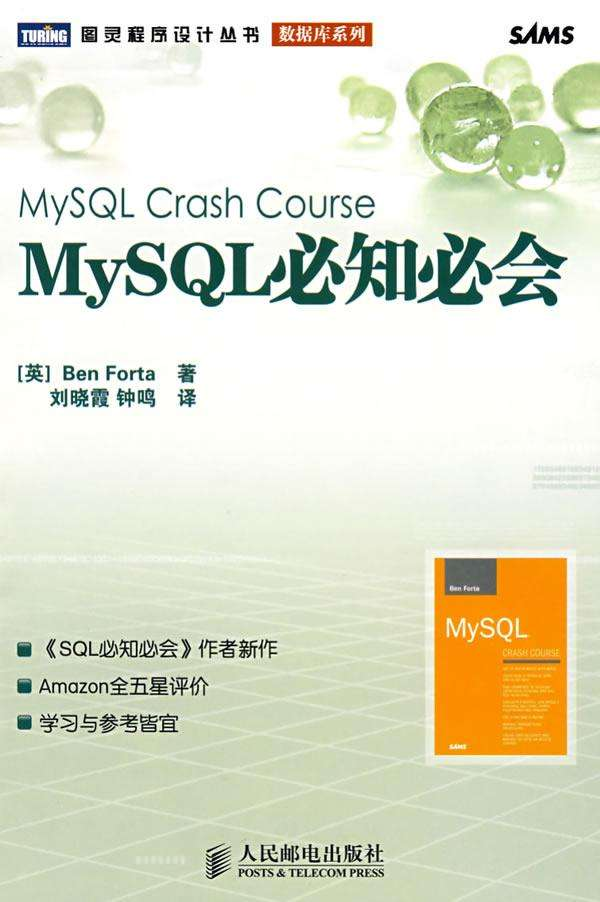

## 将<<Mysql必知必会>> 里面的sql 语句转为django 的ORM



- 以下全部 sql 语句基于 mysql 的一个命令行插件`mycli` 编写 ,所以,关键字都是小写,结尾也没有分号
- 以下所有 ORM 均在django 第三方库 `django-extensions` 的`shell_plus` 环境下编写

文件说明:

- ./img/Mysql必知必会ToDjangoORM/creat_table_sql.sql		创建数据库文件
- ./img/Mysql必知必会ToDjangoORM/data.sql                           插入具体数据文件
- ./img/Mysql必知必会ToDjangoORM/models.py                       django 的模型文件

食用方式:

- 创建数据库

- `mysql -u root -p 目标库名 < XXX.sql`         将两个数据库文件写入

- 新建django项目,新建app应用,拷贝 models.py  文件

    - 也可以根据数据库生成新的models.py文件,使用指令`python3 manage.py inspectdb > models.py`

        这时,在manage.py 同级目录下会看见一个models.py 文件,使用其`覆盖` 应用目录下的models.py文件

- 将`settings.py`中的DATABASES  指向已存在的MySQL数据库

- 最后迁移数据库`python3 manage.py migrate`

## 4.检索数据

4.2 检索单列

```sql
# sql
select prod_name from products
```

```python
# ORM
Products.objects.values('prod_name')
```

4.3 检索多列

```sql
# sql
select prod_id,prod_price,prod_name from products
```

```python
# ORM
Products.objects.values('prod_id','prod_price','prod_name')
```

4.4 检索所有列

```sql
# sql
select * from products
```

```python
# ORM
Products.objects.values()
```

4.5 检索不同的行

```sql
# sql
select distinct vend_id from products
```

```python
# ORM
Products.objects.values('vend_id').distinct()
```

4.6 限制结果

原生sql 是 `limit`

ORM 是 切片

```sql
# sql
select prod_name from products limit 5
```

```python
# ORM
Products.objects.values('prod_name')[:5]
```


## 5.排序检索数据

5.1 排序数据

```sql
# sql
select prod_name from products order by prod_name
```

```python
# ORM
Products.objects.values('prod_name').order_by('prod_name')
```

5.2 按多个列排序

```sql
# sql
select prod_id,prod_price,prod_name from products order by prod_price,prod_name
```

```python
# ORM
Products.objects.values('prod_id','prod_price','prod_name').order_by('prod_price','prod_name')
```

5.3 指定排序方向

原生sql 是 默认是升序 `desc` 是降序 

ORM 是 列名前加 `-` 负号代表降序

```sql
# sql
select prod_id,prod_price,prod_name from products order by prod_price desc
```

```python
# ORM
Products.objects.values('prod_id','prod_price','prod_name').order_by('-prod_price')
```


## 6.过滤数据

6.1 使用where子句

```sql
# sql
select prod_name,prod_price from products where prod_price=2.50
```

```python
# ORM
Products.objects.filter(prod_price=2.50).values('prod_price','prod_name')
```

6.2.2 不匹配查询

原生sql 是 `not` 

ORM 是 `exclude`

```sql
# sql
select vend_id,prod_name from products where vend_id != 1003
```

```python
# ORM
Products.objects.exclude(vend_id=1003).values('vend_id','prod_name')
```

6.2.3 范围值查询

原生sql 是 `between` 

ORM 是 `__range`

```sql
# sql
select prod_name,prod_price from products where prod_price between 5 and 10
```

```python
# ORM
Products.objects.filter(prod_price__range=(5,10)).values('prod_price','prod_name')
```


## 7.数据过滤

7.1.1 AND 操作符

```sql
# sql
select prod_id,prod_price,prod_name from products where vend_id=1003 and prod_price<=10
```

```python
# ORM
Products.objects.filter(vend_id=1003,prod_price__lte=10).values('prod_id','prod_price','prod_name')
```

7.1.2 OR操作符

```sql
# sql
select prod_name,prod_price from products where vend_id=1002 or vend_id=1003
```

```python
# ORM
Products.objects.filter(Q(vend_id=1002)|Q(vend_id=1003)).values('prod_price','prod_name')
```

7.2 IN操作符

```sql
# sql
select prod_name,prod_price from products where vend_id in (1002,1003) order by prod_name
```

```python
# ORM
Products.objects.filter(vend_id__in=(1002,1003)).values('prod_price','prod_name').order_by('prod_name')
```

7.3 NOT 操作符

```sql
# sql
Products.objects.exclude(vend_id__in=(1002,1003)).values('prod_price','prod_name').order_by('prod_name')
```

## 8.用通配符进行过滤

8.1 LIKE 操作符

```sql
# sql
select prod_id,prod_name from products where prod_name like 'jet%'
```

```python
# ORM
Products.objects.filter(prod_name__icontains='jet').values('prod_id','prod_name')

# 并不是完全等同
select prod_id,prod_name from products where prod_name like '%jet%'
```


## 9.使用正则表达式进行搜索

ORM  建议使用 `iregex` 不区分大小写

9.2.1 基本字符匹配

```sql
# sql
select prod_name from products where prod_name regexp '1000' orderby prod_name
```

```python
# ORM
Products.objects.filter(prod_name__iregex=r'1000').values('prod_name').order_by('prod_name')
```

9.2.2 进行OR匹配

```sql
# sql
select prod_name from products where prod_name regexp '1000|2000' order by prod_name
```

```python
# ORM
Products.objects.filter(prod_name__iregex=r'1000|2000').values('prod_name').order_by('prod_name')
```

9.X.X 略


## 10.创建计算字段

10.2 拼接字段

```sql
# sql
select concat(vend_name,' (',vend_country,')') as vend_title from vendors order by vend_name
```

```python
from django.db.models.functions import Concat
from django.db.models import Value

Vendors.objects.values(vend_title=Concat('vend_name',Value(' ('),'vend_country',Value(')'))).order_by('vend_name')
```

10.3 执行算数运算

检索订单号为20005中所有的物品,并汇总物品价格

```sql
# sql
select prod_id,quantity,item_price,quantity*item_price as expanded_price from orderitems where order_num=20005
```

```python
# ORM
Orderitems.objects.filter(order_num=20005).values('prod_id','quantity','item_price',expanded=F('quantity')*F('item_price'))
```


## 11.使用数据处理函数

ORM 的数据处理都在 `from django.db.models.functions import XXX` 

11.2.1 将文本转换为大写

```sql
# sql
select vend_name,upper(vend_name) as vend_name_upcase from vendors order by vend_name
```

```python
# ORM
Vendors.objects.values('vend_name',vend_name_upcase=Upper('vend_name')).order_by('vend_name')
```

11.2.2 时间函数

检索出2005年9月下的所有订单

```sql
# sql
select cust_id,order_num from orders where year(order_date)=2005 and month(order_date)=9
```

```python
# ORM
Orders.objects.filter(order_date__year=2005,order_date__month=9).values('cust_id','order_num')
```


## 12.聚集函数

12.1.1 AVG()函数

查询prodcts表中所有产品的平均价格

```sql
# sql
select AVG(prod_price) from products
```

```python
# ORM
Products.objects.aggregate(Avg('prod_price'))
```

12.1.2 COUNT()函数

查询customers中客户的总数

```sql
# sql
select count(*) as num_cust from customers
```

```python
# ORM
Customers.objects.aggregate(num_cust=Count('cust_id'))
```

12.1.3 MAX()函数	(略)

12.1.4 MIN()函数	 (略)

12.1.5 SUM()函数	 (略)

12.2 聚集不同的值

查询特定供应商提供的产品的平均价格,只考虑各个不同的价格

```sql
# sql
select avg(distinct prod_price) as avg_price from products where vend_id=1003
```

```python
# ORM
# 给聚集函数指定 distinct=True 的参数
Products.objects.filter(vend_id=1003).aggregate(avg_price=Avg('prod_price',distinct=True))
```

12.3 组合聚集函数

```sql
# sql
select count(*) as num_items,min(prod_price) as price_min,max(prod_price) as price_max,avg(prod_price) as price_avg from products

```

```python
# ORM
Products.objects.aggregate(num_items=Count('prod_id'),price_min=Min('prod_price'),price_max=Max('prod_price'),price_avg=Avg('prod_price'))

```


## 13.分组数据

13.2创建分组

查询每个供应商的产品数量

```sql
# sql
select vend_id,count(*) as num_prods from products group by vend_id
```

```python
# ORM
Products.objects.values('vend_id').annotate(num_prods=Count('vend_id'))
```

13.3 过滤分组

```sql
# sql
select cust_id,count(*) as orders from orders group by cust_id having count(*) >=2
```

```python
# ORM
Orders.objects.values('cust_id').annotate(orders=Count('cust_id')).filter(orders__gte=2)
```

13.3  同时使用 where 和 having

查询具有2(含)个以上,价格为10(含)以上的产品的供应商

```sql
# sql
select vend_id,count(*) as num_prods from products where prod_price>=10 group by vend_id having count(*)>=2
```

```python
# ORM
Products.objects.filter(prod_price__gte=10).values('vend_id').annotate(orders=Count('vend_id')).filter(orders__gte=2)
```

13.4 分组和排序

检索总计订单价格>=50的订单,的订单号和总价,并按总计价格排序

```sql
# sql
select order_num,sum(quantity*item_price) as ordertotal from orderitems group by order_num having sum(quantity*item_price)>=50 order by ordertotal
```

```python
# ORM
Orderitems.objects.values('order_num').annotate(ordertotal=Sum(F('quantity')*F('item_price'))).filter(ordertotal__gte=50).order_by('ordertotal')
```


## 14.使用子查询

14.2 利用子查询进行过滤

查询订购物品 TNT2 的所有客户

```sql
# sql
select cust_name,cust_contact from customers where cust_id in (select cust_id from orders where order_num in (select order_num from orderitems where prod_id = 'tnt2'))
```

```python
# ORM
Customers.objects.filter(cust_id__in=Orders.objects.filter(order_num__in=Orderitems.objects.filter(prod_id='tnt2').values('order_num')).values('cust_id')).values('cust_name','cust_contact')
```

14.3 作为计算字段使用子查询

对每个客户的订单进行计数

```sql
# sql
select cust_name,cust_state,(select count(*) from orders where orders.cust_id=customers.cust_id) as orders from customers order by cust_name
```

```python
# ORM
# 写不出来...
```


## 15.联结表

15.2 创建联结

所要查询的列不在一个表中

```sql
# sql 使用等值联结
select vend_name,prod_name,prod_price from vendors,products where vendors.vend_id=products.vend_id order by vend_name,prod_name
```

```python
# ORM
Products.objects.all().values('prod_name','prod_price',vend_name=F('vend_id__vend_name')).order_by('vend_name','prod_name')

# 该语句只是结果达到与sql相同,但是使用 connection.queries[-1]['sql'] 查看原生sql 发现,使用的是 FROM `products` INNER JOIN `vendors` ON ... 它使用的是内联结 

# 内联结和等值联结在sql层面只是写法不同,内部是相同的

```

15.2.2 内部联结

```sql
# sql 内联结
select vend_name,prod_name,prod_price from vendors inner join products on vendors.vend_id=products.vend_id
```

```python
# ORM
Products.objects.all().values('prod_name','prod_price',vend_name=F('vend_id__vend_name'))
```

15.2.3 联结多个表

查询编号为20005的订单中的物品

```sql
# sql
select prod_name,vend_name,prod_price,quantity from orderitems,products,vendors where products.vend_id=vendors.vend_id and orderitems.prod_id=products.prod_id and order_num=20005
```

```python
# ORM
Orderitems.objects.filter(order_num=20005).values('quantity',prod_name=F('prod_id__prod_name'),prod_price=F('prod_id__prod_price'),vend_name=F('prod_id__vend_id__vend_name'))

# 该语句只是结果达到与sql相同,但是使用 connection.queries[-1]['sql'] 查看原生sql 发现 
# 'SELECT `orderitems`.`quantity`, `products`.`prod_name` AS `prod_name`, `products`.`prod_price` AS `prod_price`, `vendors`.`vend_name` AS `vend_name` FROM `orderitems` INNER JOIN `products` ON (`orderitems`.`prod_id` = `products`.`prod_id`) INNER JOIN `vendors` ON (`products`.`vend_id` = `vendors`.`vend_id`) WHERE `orderitems`.`order_num` = 20005 LIMIT 21'

# 说明: 要想采用 INNER JOIN 的方式进行查询,ORM必须是从子表向主表查询,也就是正向查询

```

15.2.3 第二示例

查询订购物品 TNT2 的所有客户

```sql
# sql 第14章的例子 将子查询变更为联结查询
select cust_name,cust_contact from customers,orders,orderitems wherecustomers.cust_id=orders.cust_id and orderitems.order_num=orders.order_num and prod_id='tnt2'
```

```python
# ORM
Orderitems.objects.filter(prod_id='tnt2').values(cust_name=F('order_num__cust_id__cust_name'),cust_contact=F('order_num__cust_id__cust_contact'))
```

## 16.创建高级联结

16.1 使用表别名

```sql
# sql
select cust_name,cust_contact from customers as c,orders as o,orderitems as oi where c.cust_id=o.cust_id and oi.order_num=o.order_num and prod_id='tnt2'
```

```python
# ORM
# ORM 无需使用表别名
```

16.2.1 自联结

假如你发现某物品(其ID为DTNTR)存在问题,因此想知道生产该物品的供应商旗下的其它物品是否也存在这些问题

- 子查询

```sql
# sql 子查询
select prod_id,prod_name from products where vend_id=(select vend_id from products where prod_id='dtntr')
```

```python
# ORM 子查询
Products.objects.filter(vend_id=Products.objects.get(prod_id='dtntr').vend_id).values('prod_id','prod_name')

```

- 自联结

```sql
# sql 自联结
select p1.prod_name,p1.prod_id from products as p1,products as p2 where p1.vend_id=p2.vend_id and p2.prod_id='DTNTR'
```

```python
# ORM
# 写不出来...
```

16.2.3 外部联结

检索客户和他们的订单,包括没有订单的客户

```sql
# sql
select customers.cust_id,order_num from customers left outer join orders on customers.cust_id=orders.cust_id
```

```python
# ORM
Customers.objects.all().values('cust_id',order_num=F('orders__order_num'))

# ORM 的反向查询就是外部联结
```

16.3 使用带聚集函数的联结

检索所有客户及每个客户所下的订单数

```sql
# sql
select customers.cust_name,customers.cust_id,count(orders.order_num) as num_ord from customers inner join orders on customers.cust_id=orders.cust_id group by customers.cust_id
```

```python
# ORM
Orders.objects.all().values('cust_id').annotate(num_ord=Count('order_num')).values('num_ord','cust_id',cust_name=F('cust_id__cust_name'))
```

包含没有下订单的客户

```sql
# sql
select customers.cust_name,customers.cust_id,count(orders.order_num)as num_ord from customers left outer join orders on customers.cust_id=orders.cust_id group by customers.cust_id
```

```python
# ORM
Customers.objects.values('cust_id').annotate(num_ord=Count('orders__order_num')).values('cust_id','cust_name','num_ord')
```

## 17.组合查询

17.2.1 使用 UNION

查询价格小于等于5的所有商品,并且包括供应商1001,1002的所有商品(不考虑价格)

```sql
# sql
select vend_id,prod_id,prod_price from products where prod_price<=5 union select vend_id,prod_id,prod_price from products where vend_id in (1001,1002)
```

```python
# ORM
Products.objects.filter(prod_price__lte=5).values('vend_id','prod_id','prod_price').union(Products.objects.filter(vend_id__in=(1001,1002)).values('vend_id','prod_id','prod_price'))

# 也可以省略第二句的values()
Products.objects.filter(prod_price__lte=5).values('vend_id','prod_id','prod_price').union(Products.objects.filter(vend_id__in=(1001,1002)))
```

172.2.3 包含重复的行

```sql
# sql
select vend_id,prod_id,prod_price from products where prod_price<=5 union all select vend_id,prod_id,prod_price from products where vend_id in (1001,1002)
```

```python
# ORM 指定参数 union(..., all=True)
Products.objects.filter(prod_price__lte=5).values('vend_id','prod_id','prod_price').union(Products.objects.filter(vend_id__in=(1001,1002)),all=True)
```

17.2.4 对组合查询结果排序

在使用UNION组合查询时,只能使用一条ORDER BY 子句,它必须出现在最后一条SELECT语句之后,对于结果集,不存在用一种方式排序一部分,用另一种方式排序另一部分的情况

```sql
# sql
select vend_id,prod_id,prod_price from products where prod_price<=5 union select vend_id,prod_id,prod_price from products where vend_id in (1001,1002) order by vend_id,prod_price
```

```python
# ORM
Products.objects.filter(prod_price__lte=5).values('vend_id','prod_id','prod_price').union(Products.objects.filter(vend_id__in=(1001,1002))).order_by('vend_id','prod_price')
```

## 18.全文本搜索

ORM 中没找到 Match()和Against()这两个函数...

## 19.插入数据

## 20.更新和删除数据

## 21.创建和操纵表

## 22.使用视图

## 23.使用存储过程
